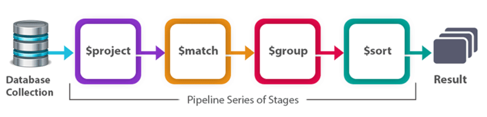

# Aggregation

<br>

* ### [Aggregation Pipeline](#aggregation-pipeline)
* ### [Stages Of Aggregation Pipeline](#stages-of-aggregation-pipeline)
* ### [Building Example Aggregation Pipeline](#building-example-aggregation-pipeline)
* ### [Define Custom Function](#define-custom-function)
* ### [Advanced Performence Optimization](#advanced-performence-optimization)

<br><br>

## [Aggregation Pipeline](#aggregation-pipeline)
* The aggregation pipeline is a framework for performing multi-stage data processing transformations on documents.
* Each stage in the pipeline represents a different data processing operation, such as filtering, grouping, sorting, projecting, etc.
* Data flows through the stages sequentially, with the output of one stage serving as the input to the next stage.

<br>

## [Stages Of Aggregation Pipeline](#stages-of-aggregation-pipeline)


### Common Stages In Aggregation Pipeline
* **$limit** : Limits the number of documents passed to the next stage.
* **$skip** : Skips a specified number of documents.
* **$unwind** : Deconstructs an array field from the input documents and outputs one document for each element.
* **$lookup** : Performs a left outer join to another collection in the same database.
* **$project** : Reshapes documents by including, excluding, or adding fields.
* **$match** : Filters documents to pass only those that match the specified conditions.
* **$group** :  Groups documents by a specified key and applies aggregation functions to each group.
* **$sort** : Orders the documents based on specified fields.

<br>

## [Building Example Aggregation Pipeline](#building-example-aggregation-pipeline)
```sh
db.CollectionName.aggregate([
   { $match: { status: "A" } },
   { $group: { _id: "$category", total: { $sum: "$quantity" } } },
   { $sort: { total: -1 } },
   { $limit: 5 }
]);

# This example filters documents with status "A", groups them by category, calculates the total quantity for each category, sorts the results by total quantity in descending order, and finally limits the output to the top 5 categories.
```

<br>

## [Define Custom Function](#define-custom-function)
* The collection contains documents representing students' names and their marks in different subjects.
* create custom expressions and functions within MongoDB to perform specific tasks, such as calculating grades based on total marks.

```sh
> db.students.aggregate([
  # Unwind the marks array to create a document for each subject
  { $unwind: "$marks" },

  # Group by student name and calculate the total marks
  {
    $group: {
      _id: "$name",
      totalMarks: { $sum: "$marks" }
    }
  },

  # Project the required fields
  {
    $project: {
      _id: 0,
      studentName: "$_id",
      totalMarks: 1,
      grade: {
        $function: {
          body: function(totalMarks) {
            if (totalMarks >= 90) {
              return "A";
            } else if (totalMarks >= 80) {
              return "B";
            } else if (totalMarks >= 70) {
              return "C";
            } else {
              return "D";
            }
          },
          args: ["$totalMarks"],
          lang: "js"
        }
      }
    }
  }
])
```

<br>

## [Advanced Performence Optimization](#advanced-performence-optimization)
1. Aggregation Pipeline: Explains the concept of the aggregation pipeline, consisting of multiple stages for performing advanced operations.

2. Match Stage: Filters documents based on specific criteria, narrowing down the dataset.

3. Projection Stage: Shapes the output by including, excluding, or reshaping fields, allowing for selective field retrieval.

4. Group Stage: Groups documents together, enabling aggregation functions like sum, count, and average to be applied to specific fields.

5. Sort and Limit Stage: Sorts documents in ascending or descending order and limits the number of documents returned.

6. Unwind Stage: Flattens arrays, creating multiple output documents for each array element.

7. Lookup Stage: Combines documents from two collections based on common fields, akin to a join operation, useful for data enrichment.

8. Facet Stage: Performs multiple independent aggregations within a single pipeline, enabling parallel computation of various statistics or aggregations.

9. Out Stage: Stores the result of an aggregation pipeline in a new collection for future analysis.

10. Time Series Analysis: Groups data based on time intervals for analyzing trends, calculating moving averages, etc.

11. Text Search and Analysis: Enables full-text search, keyword extraction, and sentiment analysis.

12. Geospatial Aggregation: Works with location data for tasks like calculating distances and finding nearest locations.

13. Event Aggregations and Analysis: Analyzes event data, identifies patterns, and triggers actions based on conditions.

14. Recommendation Systems: Utilizes user preferences and purchase histories to suggest personalized content.

15. Market Basket Analysis: Analyzes transaction data to identify frequently purchased items together, aiding inventory management and marketing.