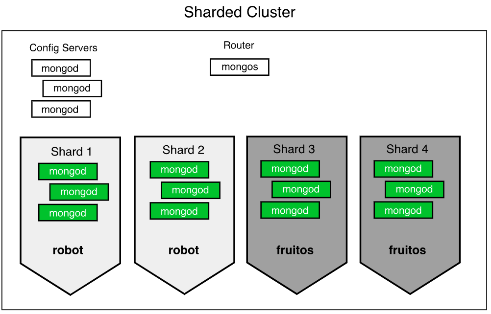

# Sharding In MongoDB



<br>

* ### [What is Sharding](#what-is-sharding)
* ### [Benifits Of Sharding](#benifits-of-sharding)
* ### [Sharding Key And How To Selected](#sharding-key-and-how-to-selected)
* ### [Mongo Query Router](#mongo-query-router)
* ### [Hash Based Sharding](#hash-based-sharding)
* ### [Ranged Based Sharding](#hash-based-sharding)
* ### [Zoned Sharding](#zoned-sharding)
* ### [Configure and Manage Sharded Clusters](#configure-and-manage-sharded-clusters)

<br>

## [What is Sharding](#what-is-sharding)
* Sharding in MongoDB is a method for distributing data across multiple servers, known as shards, to ensure horizontal scalability and high availability of large datasets.

* Sharding is typically associated with large databases due to its primary benefits of scalability and performance optimization. However, it’s not limited to big databases only.

<br>

## [Benifits Of Sharding](#benifits-of-sharding)

1. **Scalability** : As data volume grows, a single server may not be able to handle the storage and processing requirements. Sharding allows the database to scale out by distributing the data across multiple servers.

2. **Performance** : Distributing the data can improve query performance since different servers can handle different parts of the data simultaneously.

3. **High Availability** : Sharding can also enhance the availability of the database. If one shard fails, the data can still be accessed from other shards.

<br>

## [Sharding Key And How To Selected](#sharding-key-and-how-to-selected)

* Is `specific field or combination of fields` within a MongoDB `document` that `determines` how data is `distributed across the shards` in a sharded cluster.

* Each `json document` must have field of `shard key`

* It ensures that data is partitioned and stored in a way that optimizes distribution, balances the load, and improves query performance.


### Selecting Shard Key

* **Height Cardinality** : The uniqueness of data values contained in a particular field. It is a measure of how many unique values exist for a field in a dataset.


<br>

## [Mongo Query Router](#mongo-query-router)

* Also known as `mongos`

* Lightweight `process routes` client `requests` to the `appropriate shard(s)` based on the `shard key`.

* Abstracts the complexity of the sharded architecture providing a single interface for interacting with the distributed data.

### How It Works

* **Shard Key-Based Routing** : When a `query` includes the `shard key`, `Mongo Query Router` uses the metadata from the config servers to determine the shard(s) that hold the relevant data. It then routes the query directly to those shard(s).

* **Broadcast Queries** : If a `query does not include the shard key` or `cannot be routed based on the shard key alone`, mongos `broadcasts the query to all shards`. This can be `less efficient`, which is why designing queries to include the shard key is beneficial.

### Config Servers

* **Role** : Config servers store the metadata about the sharded cluster. This includes the namespace, shard key, chunk ranges, and shard locations.

* **Coordination with Mongos** : Mongos consults the config servers to obtain the information needed to route operations efficiently.

<br>

## [Configure and Manage Sharded Clusters](#configure-and-manage-sharded-clusters)
1. **Start Config Servers** : Config servers store metadata and configuration settings for the cluster. We will start three config servers for redundancy.
```sh
> mongod --configsvr --replSet <ConfigReplSetName> --port <Port Number 1> --dbpath <path 1>

> mongod --configsvr --replSet <ConfigReplSetName> --port <Port Number 2> --dbpath <path 2>

> mongod --configsvr --replSet <ConfigReplSetName> --port <Port Number 3> --dbpath <path 3>
```

2. Initiate Config Server Replica Set
Connect to one of the config servers and initiate the replica set.

```sh
> mongo --port <Port Number 1>
```

3. Start Shard Servers
we need to start the shard servers. For simplicity, we'll start two shard servers, each with its own replica set.

```sh
> mongod --shardsvr --replSet <ConfigShardName 1> --port <Port Number 4> --dbpath <path shard1>

> mongod --shardsvr --replSet <ConfigShardName 2> --port <Port Number 5> --dbpath <path shard2>
```

4. Initiate Shard Replica Sets
```sh
# Connect to shard 1 and initiate replica set
> mongo --port <Port Number 4>

> rs.initiate({
  _id: "<ConfigShardName 1>",
  members: [{ _id: 0, host: "<host>:<Port Number 4>" }]
 })

# Connect to shard 2 and initiate replica set
> mongo --port <ConfigShardName 2>

> rs.initiate({
  _id: "<ConfigShardName 2>",
  members: [{ _id: 0, host: "<host>:<Port Number 5>" }]
 })
```

5. Start Query Routers (mongos)
```sh
> mongos --configdb <ConfigReplSetName>/<host>:<Port Number 1>,<host>:<Port Number 2>,<host>:<Port Number --port <Port Number 6>
```

6. Add Shards to the Cluster (Using mongosh)
```sh
> mongosh --port <Port Number 6>

> sh.addShard("<ConfigShardName 1>/<host>:<Port Number 4>")
> sh.addShard("<ConfigShardName 2>/<host>:<Port Number 5>")
```

7. Enable Sharding for a Database
```sh
> mongosh --port <Port Number 6>

> sh.enableSharding("<Db Name>")

# Create an index on the shard key
> use <Db Name>
> db.CollectionName.createIndex({ shardKey: 1 })

# Shard the collection
> sh.shardCollection("<Db Name>.CollectionName", { shardKey: 1 })
```

8. Verify Sharding Configuration
```sh
# Check sharding status
> sh.status()

# Verify the sharded collection
> db.CollectionName.getShardDistribution()
```

9. Managing Sharded Clusters
Here are some common management tasks for sharded clusters:

5. 1. **Balancing Data**:
MongoDB automatically balances data across shards. However, you can manually trigger a balancer if needed.
```sh
# Start the balancer
> sh.startBalancer()

# Stop the balancer
> sh.stopBalancer()
```

5. 2. **Monitoring the Cluster**
```sh
# Connect to mongos and use the admin database
> use admin

# Check the balancer status
> db.printShardingStatus(true)

# Monitor current operations
> db.currentOp() 
```